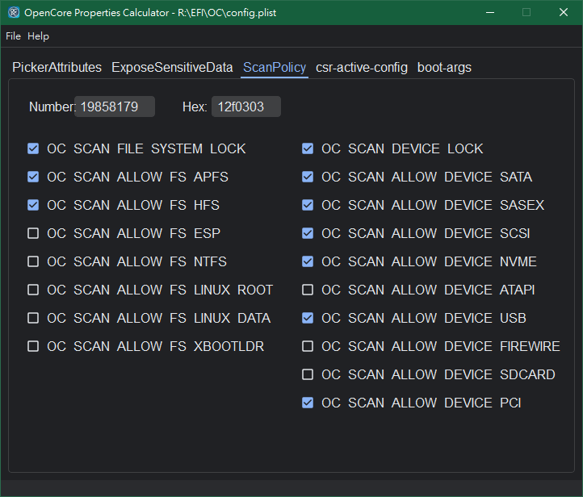

OpenCore Config Properties Calculator
==============================

A small tools to calculate OpenCore config properties value. Easy to use.



### Introduction

- Support calculate 4 properties: **`PickerAttributes`**, **`ExposeSensitiveData`**, **`ScanPolicy`**, **`csr-active-config`**.
- Load & save OencCore config file `config.plist`. Support all OC version. 
- Support Windows / macOS / Linux (Ubuntu, Debian...etc)
- Support "checkboxes to value" and "value to checkboxes" at the same user interface.

### Requirements
- Python 3 installed ( >= 3.7)
   - Dependent on packages: pyqt5, pyqtdarktheme, darkdetect (installed via pip)
   - For Python 3.12, install `pyqtdarktheme` requires option `--ignore-requires-python` of `pip` command. For example:
     ```shell
     pip install pyqtdarktheme==2.1.0 --ignore-requires-python
     ```

### Launch application
- Launch with python command:
  - Windows 
  ```shell
  python OCPropCal.py
  ```
  - macOS / Linux 
  ```shell
  python3 OCPropCal.py
  ```
- Load `config.plist`
  - Use menu action `File -> Open` or just drag & drop plist file (ie. `config.plist`) into application.
  - Without plist file, it works as calculation for properties values.

### Create executable file
You can use pyinstaller command to create direct executable file:
- Windows 
```Shell
pyinstaller OCPropCal-win.spec
```
- macOS 
```Shell
pyinstaller OCPropCal-macOS.spec
```

### Customize localized
Edit `DropDesc.json` for your needed with JSON format.


### Properties
For more information, please see [OpenCore Reference Mamual](https://dortania.github.io/docs/latest/Configuration.html).
#### `PickerAttributes`
| Title  | Content |
|--------|---------|
|Located | `Misc -> Boot -> PickerAttributes`|
|Type    | plist integer|
|Failsafe| 0|
|Description| Sets specific attributes for the OpenCore picker.|

- 0x0001 — `OC_ATTR_USE_VOLUME_ICON`, provides custom icons for boot entries.
- 0x0002 — `OC_ATTR_USE_DISK_LABEL_FILE`, provides custom rendered titles for boot entries.
- 0x0004 — `OC_ATTR_USE_GENERIC_LABEL_IMAGE`, provides predefined label images for boot entries.
- 0x0008 — `OC_ATTR_HIDE_THEMED_ICONS`, prefers builtin icons for certain icon categories.
- 0x0010 — `OC_ATTR_USE_POINTER_CONTROL`, enables pointer control the OpenCore picker when available.
- 0x0020 — `OC_ATTR_SHOW_DEBUG_DISPLAY`, enable display of additional timing and debug information.
- 0x0040 — `OC_ATTR_USE_MINIMAL_UI`, use minimal UI display, no Shutdown or Restart buttons.
- 0x0080 — `OC_ATTR_USE_FLAVOUR_ICON`, provides flexible boot entry content description, suitable for picking the best media across different content sets.
- 0x0100 — `OC_ATTR_USE_REVERSED_UI`, reverse position of Shutdown and Restart buttons, affects Open Canopy and builtin picker.
- 0x0200 — `OC_ATTR_REDUCE_MOTION`, reduce password and menu animation in OpenCanopy, leaving only animations which communicate information not otherwise provided.

#### `ExposeSensitiveData`
| Title  | Content |
|--------|---------|
|Located | `Misc -> Security -> ExposeSensitiveData`|
|Type    | plist integer|
|Failsafe| 0x6|
|Description| Sensitive data exposure bitmask (sum) to operating system.|

- 0x01 — Expose the printable booter path as a UEFI variable.
- 0x02 — Expose the OpenCore version as a UEFI variable.
- 0x04 — Expose the OpenCore version in the OpenCore picker menu title.
- 0x08 — Expose OEM information as a set of UEFI variables.

#### `ScanPolicy`
| Title  | Content |
|--------|---------|
|Located | `Misc -> Security -> ScanPolicy`|
|Type    | plist integer|
|Failsafe| 17760515 ``(0x10F0103)``|
|Description| Define operating system detection policy.|

- 0x00000001 (bit 0) — `OC_SCAN_FILE_SYSTEM_LOCK`, restricts scanning to only known file systems defined as a part of this policy. File system drivers may not be aware of this policy. Hence, to avoid mounting of undesired file systems, drivers for such file systems should not be loaded. This bit does not affect DMG mounting, which may have any file system. Known file systems are prefixed with OC_SCAN_ALLOW_FS_.
- 0x00000002 (bit 1) — `OC_SCAN_DEVICE_LOCK`, restricts scanning to only known device types defined as a part of this policy. It is not always possible to detect protocol tunneling, so be aware that on some systems, it may be possible for e.g. USB HDDs to be recognised as SATA instead. Cases like this must be reported. Known device types are prefixed with OC_SCAN_ALLOW_DEVICE_.
- 0x00000100 (bit 8) — `OC_SCAN_ALLOW_FS_APFS`, allows scanning of APFS file system.
- 0x00000200 (bit 9) — `OC_SCAN_ALLOW_FS_HFS`, allows scanning of HFS file system.
- 0x00000400 (bit 10) — `OC_SCAN_ALLOW_FS_ESP`, allows scanning of EFI System Partition file system.
- 0x00000800 (bit 11) — `OC_SCAN_ALLOW_FS_NTFS`, allows scanning of NTFS (Msft Basic Data) file system.
- 0x00001000 (bit 12) — `OC_SCAN_ALLOW_FS_LINUX_ROOT`, allows scanning of Linux Root file systems.
- 0x00002000 (bit 13) — `OC_SCAN_ALLOW_FS_LINUX_DATA`, allows scanning of Linux Data file systems.
- 0x00004000 (bit 14) — `OC_SCAN_ALLOW_FS_XBOOTLDR`, allows scanning the Extended Boot Loader Partition as defined by the Boot Loader Specification.
- 0x00010000 (bit 16) — `OC_SCAN_ALLOW_DEVICE_SATA`, allow scanning SATA devices.
- 0x00020000 (bit 17) — `OC_SCAN_ALLOW_DEVICE_SASEX`, allow scanning SAS and Mac NVMe devices.
- 0x00040000 (bit 18) — `OC_SCAN_ALLOW_DEVICE_SCSI`, allow scanning SCSI devices.
- 0x00080000 (bit 19) — `OC_SCAN_ALLOW_DEVICE_NVME`, allow scanning NVMe devices.
- 0x00100000 (bit 20) — `OC_SCAN_ALLOW_DEVICE_ATAPI`, allow scanning CD/DVD devices and old SATA.
- 0x00200000 (bit 21) — `OC_SCAN_ALLOW_DEVICE_USB`, allow scanning USB devices.
- 0x00400000 (bit 22) — `OC_SCAN_ALLOW_DEVICE_FIREWIRE`, allow scanning FireWire devices.
- 0x00800000 (bit 23) — `OC_SCAN_ALLOW_DEVICE_SDCARD`, allow scanning card reader devices.
- 0x01000000 (bit 24) — `OC_SCAN_ALLOW_DEVICE_PCI`, allow scanning devices directly connected to PCI bus (e.g. VIRTIO).

#### `csr-active-config`
| Title  | Content |
|--------|---------|
|Located | `NVRAM -> Add -> 7C436110-AB2A-4BBB-A880-FE41995C9F82 -> csr-active-config`|
|Type    | plist Data|
|Failsafe| <00000000>|
|Description| 32-bit System Integrity Protection bitmask. Declared in XNU source code in [csr.h](https://opensource.apple.com/source/xnu/xnu-7195.81.3/bsd/sys/csr.h.auto.htmll).[(ref)](https://khronokernel.com/macos/2022/12/09/SIP.html)|
- 0x00000001 (bit 0) — `CSR_ALLOW_UNTRUSTED_KEXTS`
  - Introduction: 10.11 - El Capitan
  - Description: Allows unsigned [kernel drivers](https://support.apple.com/en-ca/guide/deployment/depa5fb8376f/web) to be installed and loaded
- 0x00000002 (bit 1) — `CSR_ALLOW_UNRESTRICTED_FS`
  - Introduction: 10.11 - El Capitan
  - Description: Allows unrestricted file system access
- 0x00000004 (bit 2) — `CSR_ALLOW_TASK_FOR_PID`
  - Introduction: 10.11 - El Capitan
  - Description: Allows tracking processes based off a provided process ID
- 0x00000008 (bit 3) — `CSR_ALLOW_KERNEL_DEBUGGER`
  - Introduction: 10.11 - El Capitan
  - Description: Allows attaching low level kernel debugger to system
- 0x00000010 (bit 4) — `CSR_ALLOW_APPLE_INTERNAL`
  - Introduction: 10.11 - El Capitan
  - Description: Allows Apple Internal feature set (primarily for Apple development devices)
- 0x00000020 (bit 5) — `CSR_ALLOW_UNRESTRICTED_DTRACE`
  - Introduction: 10.11 - El Capitan
  - Description: Allows unrestricted [dtrace](http://about.dtrace.org/) usage
- 0x00000040 (bit 6) — `CSR_ALLOW_UNRESTRICTED_NVRAM`
  - Introduction: 10.11 - El Capitan
  - Description: Allows unrestricted [NVRAM](https://en.wikipedia.org/wiki/Non-volatile_random-access_memory) write
- 0x00000080 (bit 7) — `CSR_ALLOW_DEVICE_CONFIGURATION`
  - Introduction: 10.11 - El Capitan
  - Description: Allows custom device trees (primarily for iOS devices)
    - Note: This is based off speculation, currently little public info on what uses this bit provides
- 0x00000100 (bit 8) — `CSR_ALLOW_ANY_RECOVERY_OS`
  - Introduction: 10.12 - Sierra
  - Description: Skip BaseSystem Verification, primarily for custom recoveryOS images
- 0x00000200 (bit 9) — `CSR_ALLOW_UNAPPROVED_KEXTS`
  - Introduction: 10.13 - High Sierra
  - Description: Allows unapproved [kernel driver](https://support.apple.com/en-ca/guide/deployment/depa5fb8376f/web) installation/loading
    - Note: Current use-case unknown
- 0x00000400 (bit 10) — `CSR_ALLOW_EXECUTABLE_POLICY_OVERRIDE`
  - Introduction: 10.14 - Mojave
  - Description: Allows override of executable policy
    - Note: Current use-case unknown
- 0x00000800 (bit 11) — `CSR_ALLOW_UNAUTHENTICATED_ROOT`
  - Introduction: 11 - Big Sur
  - Description: Allows custom APFS snapshots to be booted (primarily for modified root volumes)

